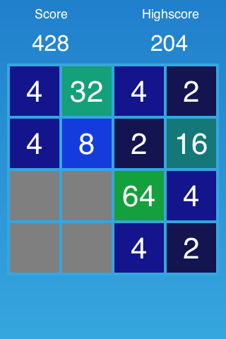
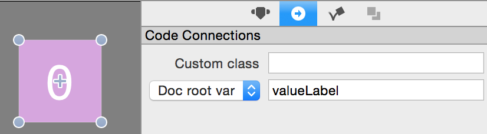

In this tutorial we will build Make2048 -- a clone of the popular mobile game [2048](https://itunes.apple.com/us/app/2048-by-gabriele-cirulli/id868076805?mt=8). The gameplay itself is simple but coding the game comes with some puzzles and challenges. You will learn a lot in the next couple of hours! We will use Apple's new Swift programming language together with SpriteBuilder and Cocos2D.

<!-- If you aren't familiar with SpriteBuilder you should read our [SpriteBuilder beginner tutorial](https://www.makeschool.com/tutorials/getting-started-with-spritebuilder-and-swift/installing-spritebuilder) first since this tutorial assumes that you are familiar with basic SpriteBuilder tasks. Make sure you have both SpriteBuilder and Xcode installed! -->

#What you will learn

Throughout this tutorial you will learn many concepts including how to:

- Think critically about game logic
- Prototype a puzzle game without any assets
- Chain CCActions together to animate from code

#The finished product

The final game will look like this:

<!-- TODO: update with gif -->

Let's get started with a blank SpriteBuilder project!

#Set up the basic structure in SpriteBuilder

A good starting point for every SpriteBuilder project is creating the outline of the game. For 2048 this will be rather simple. We are going to work with only one scene. We will add a grid to that scene and we will create a ccb file that will represent a single tile in our game.

> [action]
> First, **create a new SpriteBuilder project** with `Swift` as the *primary language*. The first change we need to apply to the project is the device orientation. 2048 is a portrait game so let's change the game orientation to portrait:
>
> 
>
> In the next step remove the "SpriteBuilder" label from the scene (select the label and hit backspace).

#Adding the grid

Now we can add the grid to the screen. We will only add a grid background in SpriteBuilder. The 16 cells (4x4) that hold the game tiles will be rendered in code.

For the Grid background we use a *Color Node*. 

> [action]
> Drag the *Color Node* onto the stage of MainScene.ccb. Apply the following settings to the node:
>
> * The anchor point should be `(0.5, 0.5)`
> * Position type should be *in percent of parent container*
> * The position should be `(50%, 50%)`, this will center the node
> * The size needs to be `(300, 300)`

Now a 300x300 grid background should be centered within *MainScene*.

We also need to set up some code connections for the grid. The grid will have a custom class - this is where the most game logic will be located and the *MainScene* will have a variable that references the grid.

> [action]
> Select the grid and open the code connections tab:
>
> 

#Adding score labels

Another important part of the *2048* UI are labels that display the score of the current game and the highscore. We are going to add these labels to *MainScene* as well.

> [action]
> Add two instances *Label TTF* above the grid. The first should be set up as follows:
> 
> * Position Reference Corner: `Top left`
> *	Position: `(70.0, 30.0)`
> * Label text: `Score`
> * Font size: `18`
> 
> This is what it should look like when you're done:
> 
> 
> 
> Now set up the second label:
> 
> *	Position Reference Corner: `Top right`
> *	Position: `(70.0, 30.0)`
> * Label text: `High Score`
> * Font size: `18`
> 
> 

Notice that the two labels' *Position* attributes are the same in points, yet they're visibly different. That's because when we change the *Position Reference Corner*, we're changing what *Position* is based upon. This provides more flexibility when it comes to different screen sizes - the labels will automatically space themselves in the top corners. Go ahead and see for yourself! Go to Document -> Resolution -> Tablet Portrait. See how the labels are still positioned in the top corners of the screen?

> [action]
> Drag two more instances of *Label TTF* onto the screen so we can display the actual scores. The first label should be set up as following:
> 
> * Position Reference Corner: `Top left`
> * Position: `(70.0, 70.0)`
> * Label text: `0`
> * Font size: `32`
> 
> Make the second label identical except for the *Position Reference Corner*, which should be `Top right`.

All that's left is to make code connections so we can update the scores from code. 

> [action]
> Name the code connection variables `scoreLabel`  and `highscoreLabel` and make sure the selected target is `Doc root var`:
>
> 

#Add tiles

We will use SpriteBuilder to create a prototype tile. We will instantiate these tiles in code, but we will define the layout of them in SpriteBuilder.

> [action]
> Let's start by creating a new *Node* CCB file:
>
> 
>
> Select the root node of *Tile.ccb* and set the size to be (70,70). This way the four tiles in each row will use 280 out of 300 points and we have 20 points left for margins between the tiles.
>
> 

In our version of *2048* each tile will have a solid background color that will change whenever the value of a tile changes. 

> [action]
> Since we need to modify the behaviour of this tile in code, we need to link it to a custom class called *Tile*:
>
> 

Now we can work on adding a background color to the tile. The easiest way to apply a background color to this tile is adding a *Color Node* to *Tile.ccb*.

> [action]
> Add a *Color Node* by dragging it from the left panel to the timeline on the bottom and dropping it on top of the root node (CCNode):
>
> 
>
> You now need to set up the color node to fill the entire root node by setting the content size type to be *in % of parent container* and the *content size* to (100%,100%):
>
> 
>
> Choose any color for the background node. 

Ultimately we will change the color of the tile in code. Until then, the game will use the color you choose here for all tiles. Let's set up a code connection so we can modify the color later. 

> [action]
> Select the *CCNodeColor* you just added and call it *backgroundNode*. Make sure it's a `Doc root var`:
>
> 

The only step left before we dive into code is adding a label to the tile that will display the current value of it.

> [action]
> Drag a *Label TTF* from the node library and add it as a child of the *Color Node*. You can either do this by dropping the label to the stage or to the timeline:
>
> 
>
> Once you have added the label you need to change a couple of settings:
>
> 
> 
> * Center the label by choosing the positioning type `in % of parent container` and choosing `(50%, 50%)` as position
> * Set the font size to `42`
> * Check the checkbox `Adjust font size to fit`. This will automatically reduce the font size for larger numbers to make the text fit the specified dimensions
> * Set the dimensions to `(70, 70)`
> * Set alignment to `Center` and `Center`
> 
> Last but not least, we need a code connection for this label - we will want to change the value it displays when we merge > tiles. Name the variable `valueLabel`  and assign it to `Doc root var`:
> 
> 

Now we have the basic outline set up in SpriteBuilder including a grid, tiles and score labels. **Don't forget to publish the SpriteBuilder project!** You can do this by pressing the publish button in the top left of SpriteBuilder's interface, or by selecting File -> Publish. Open your project in Xcode by going to File -> Open Project in Xcode. Let's start coding!
