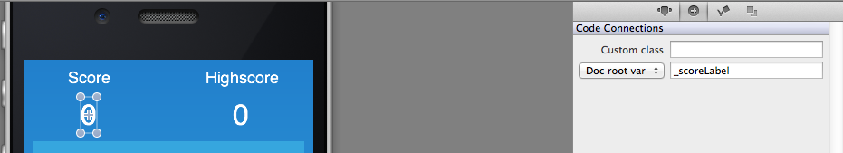
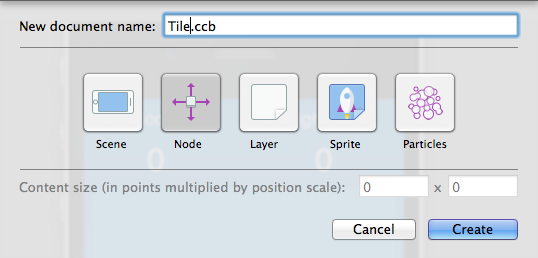
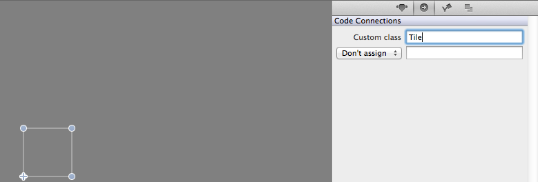

This tutorial will explain in detail how to build the popular game *2048* from scratch, using SpriteBuilder and Cocos2D. The gameplay itself is simple but coding the game comes alongside with some puzzles and challenges. You will learn a lot in the next couple of hours!

You can find the entire code for this tutorial on [GitHub](https://github.com/MakeSchool/2048-SpriteBuilder-Tutorial). The commits follow the structure of this tutorial so you are also able to take a look at the code of the intermediate steps.

# Set up the basic structure in SpriteBuilder

A good starting point for every SpriteBuilder project is creating the outline of the game. For 2048 this will be rather simple. We are going to work with only one scene. We will add a grid to that scene and we will create a ccb file that will represent a single tile in our game.

First, **create a new SpriteBuilder project**. The first change we need to apply to the project is the device orientation. 2048 is a portrait game so let's change the game orientation to portrait:

In the next step remove the "SpriteBuilder" label from the scene (select the label and hit backspace).

## Adding the Grid

Now we can add the grid to the screen. We will only add a grid background in SpriteBuilder. The 16 cells (4x4) that hold the game tiles will be rendered in code.

For the Grid background we use a *Color Node*. Drag the *Color Node* onto the stage of MainScene.ccb. Apply the following settings to the node:

*   The anchor point should be (0.5, 0.5)
*   Position type should be *in percent of parent container*
*   The position should be (50%, 50%), this will center the node
*   The size needs to be (300,300)

Now a 300x300 grid background should be centered within *MainScene*.

We also need to set up some code connections for the grid. The grid will have a custom class - this is where the most game logic will be located and the *MainScene* will have a variable that references the grid. Select the grid and open the code connections tab:

## Adding Score Labels

Another important part of the *2048* UI are labels that display the score of the current game and the highscore. We are going to add these labels to *MainScene* as well. Add four instances *Label TTF* above the grid.

The labels should be set up as following:

*   Top label font size: 18
*   Bottom label font size: 32
*   Position Reference Corner: Top left
*   Horizontal and Vertical Alignment: Center

Positioning the labels from the top left corner will make the interface look good on 3.5 and 4 inch phones. You can switch between previews for both device types through the *Document -&gt; Resolution* menu in the top menu.

The labels also need code connections so that we can update the score and the highscore within our game code later on. Add code connections for both labels:

Name the code connection variables *_scoreLabel*  and *_highscoreLabel* and make sure the selected target is *Doc root var*.

## Add Tiles

We will use SpriteBuilder to create a prototype tile. We will instantiate 16 of these tiles in code, but we will define the layout of them in SpriteBuilder. Let's start by creating a new CCB file:

The type of the new CCB file should be *Node*.

Select the root node of *Tile.ccb* and set the size to be (70,70). This way the four tiles in each row will use 280 out of 300 points and we have 20 points left for margins between the tiles. In our version of *2048* each tile will have a solid background color that will change whenever the value of a tile changes. Since we need to modify the behaviour of this tile in code, we need to link it to a custom class:

Link the root node of *Tile.ccb* to a class called *Tile.*

Now we can work on adding a background color to the tile. The easiest way to apply a background color to this tile is adding a *Color Node* to *Tile.ccb.* Add a *Color Node* by dragging it from the left panel to the timeline on the bottom and dropping it on top of the root node (CCNode):

You now need to set up the color node to fill the entire root node by setting the content size type to be *in % of parent container* and the *content size* to (100%,100%):

You can also choose a color for the backgroud node. When we finalize the game we will change the color of the tile in code, until then the game will use the color you choose here for all tiles. We need to set up a variable that references this *Color Node* so that we can change the color in code:

Link the *Color Node* to a variable called *_backgroundNode* and set the target to *Doc root var*. We are very close to completing the basic setup in SpriteBuilder and diving into the code.

The only step left is adding a label to the tile that will display the current value of it. Drag a *Label TTF* from the node library and add it as a child of the *Color Node*. You can either do this by dropping the label to the stage or to the timeline:

Once you have added the label you need to change a couple of settings:

*   Center the label by choosing the positioning type *in % of parent container* and choosing (50%,50%) as position
*   Set the font size to 42
*   Check the checkbox *Adjust font size to fit.* This will automatically reduce the font size for larger numbers to make the text fit the specified dimensions
*   Set the dimensions to (70,70)

Last but not least we need a code connection for this label - we will want to change the value it displays when we merge tiles:

Name the variable *_valueLabel*  and assign it to *Doc root var*.

Now we have the basic outline set up in SpriteBuilder including a grid, tiles and score labels. As a next step **publish the SpriteBuilder project** and open the Xcode project. Let's start coding!

# Setup project in Xcode

Before we start implementing the actual game logic we need to create classes and variables for the code connections we have created in SpriteBuilder. In Xcode you can create a new class by selecting *File -&gt; New File...* and selecting *Objective-C* class in the next step. We need to create one class called *Grid* and one class called *Tile.*

Let's start with the *Grid* class:

Since the Grid has a type of *Color Node* in SpriteBuilder it needs to inherit from *CCNodeColor*. The Objective-C class always needs to match the node type in SpriteBuilder.

The second class we need to add is the *Tile* class. It needs to be subclass of *CCNode*:

Now that we have created both classes we need to set up the variables for the connections we defined in SpriteBuilder. Since all of these variables are private (no other class needs to see them) we will add all variable definitions to the *.m* files of our classes.

Let's start with *MainScene*. Open *MainScene.m* in Xcode. Add variables and import statements to make *MainScene.m* contain the following code:

    #import "MainScene.h"
    #import "Grid.h"
    @implementation MainScene {
    	Grid *_grid;
    	CCLabelTTF *_scoreLabel;
    	CCLabelTTF *_highscoreLabel;
    }
    @end

The above lines import the *Grid* class and create variables that reference the grid and both score labels that we placed in this scene using SpriteBuilder.

Next, open *Tile.m* and add the following variables:

    @implementation Tile {
    	CCLabelTTF *_valueLabel;
    	CCNodeColor *_backgroundNode;
    }

Now we have set up all required code connections and you should be able to run the game for the first time. Hit the run button in Xcode and you should see this game on the iPhone simulator:

Pretty empty - but it's up and running. Next we will render 16 cells as background for our grid.

# Render a grid background

We are going to implement the background rendering in the grid class. Open *Grid.m* in Xcode.

For *2048* we need a 4x4 grid with 16 tiles spread out with a constant margin. Since we are good developers we like to create programs that have a certain flexibility - this means we don't want our program to break when simple parameters change. An example: if we come up with a good solution it should be fairly easy to change the game and make it use a 5x5 grid instead of a 4x4 one.

This means we will have to calculate the position of each cell in code, instead of defining them initially upfront. The relevant factors for positioning the 16 cells are:

*   the size of the grid
*   the size of the tiles
*   the margin between the tiles

We are going to implement a mechanism that reads the grid size and the tile size and calculates a margin automatically. We will need to add variables and constants to our *Grid* class to store all this information:

    @implementation Grid {
    	CGFloat _columnWidth;
    	CGFloat _columnHeight;
    	CGFloat _tileMarginVertical;
    	CGFloat _tileMarginHorizontal;
    }
    static const NSInteger GRID_SIZE = 4;

We create 4 float variables that store information about the grid and one constant that defines the amount of tiles in the grid - by default we assume a 4x4 grid.

Now we need to add a method that renders 16 empty cells to our grid. We will call it *setupBackground:*

    - (void)setupBackground
    {
    	// load one tile to read the dimensions
    	CCNode *tile = [CCBReader load:@"Tile"];
    	_columnWidth = tile.contentSize.width;
    	_columnHeight = tile.contentSize.height;
            // this hotfix is needed because of issue #638 in Cocos2D 3.1 / SB 1.1 (https://github.com/spritebuilder/SpriteBuilder/issues/638)
            [tile performSelector:@selector(cleanup)];
    	// calculate the margin by subtracting the tile sizes from the grid size
    	_tileMarginHorizontal = (self.contentSize.width - (GRID_SIZE * _columnWidth)) / (GRID_SIZE+1);
    	_tileMarginVertical = (self.contentSize.height - (GRID_SIZE * _columnWidth)) / (GRID_SIZE+1);
    	// set up initial x and y positions
    	float x = _tileMarginHorizontal;
    	float y = _tileMarginVertical;
    	for (int i = 0; i < GRID_SIZE; i++) {
    		// iterate through each row
    		x = _tileMarginHorizontal;
    		for (int j = 0; j < GRID_SIZE; j++) {
    			//  iterate through each column in the current row
    			CCNodeColor *backgroundTile = [CCNodeColor nodeWithColor:[CCColor grayColor]];
    			backgroundTile.contentSize = CGSizeMake(_columnWidth, _columnHeight);
    			backgroundTile.position = ccp(x, y);
    			[self addChild:backgroundTile];
    			x+= _columnWidth + _tileMarginHorizontal;
    		}
    		y += _columnHeight + _tileMarginVertical;
    	}
    }

This is a lot of code, but no worries, all of it is fairly straightforward. First we load a *Tile.ccb* to read the height and width of a single tile. Then we subtract the width of all tiles we need to render from the width of the grid to calculate the available width. Once we have the available width we can calculate the available horizontal margin between tiles. We do the same for the height and the vertical margin.

Once we know the margins we run through a two dimensional loop to create all tiles. We start at the first row (bottom) and render all columns of the first row (from left to right). Once we reach the last column we move to the next row. We repeat until we reach the last column of the last row (top right). The following image visualizes the loop that renders the tiles:

Now that you understand the rendering code we just need to call it. When working with scenes created in SpriteBuilder the method *didLoadFromCCB* is the right place to perform modifications that shall happen as soon as the scene gets initialized.

Let's call our new method from *didLoadFromCCB* by adding this implementation to *Grid.m*:

    - (void)didLoadFromCCB {
    	[self setupBackground];
    }

Now the background will be rendered as soon as the *MainScene.ccb* is loaded. You can run the app now and should see following result on the screen:

Well done! This is starting to look like a real game. In the next step we are going to spawn our first tiles.

# Spawn the first tiles

In this step we are going to make a lot of progress. We will create a data structure for our grid (a 2D array) and we will add methods that will spawn tiles and add them to our data structure and to our visual grid. This chapter will also be a lesson about breaking a large problem down into many small problems. Whenever we need to write a complex piece of code breaking down the problem into smaller ones should be the first step.

**The large problem:** We need to spawn a certain amount of randomly positioned tiles when our program starts. We need to add the tiles to a data structure and we need to add them visually to the grid.

**Small problems:**

*   We need the capability to spawn a random tile
*   We need to spawn **n** random tiles when the program starts
*   We need a data structure to store spawned tiles
*   We need to determine where (visually) on the grid a tile needs to be added

The next step is transforming these small problems into methods that we can implement in our program.

**Methods to solve small problems:**

*   **addTileAtColumn:Row:** adds a tile to the data structure and adds it to the visual grid with an animation
*   **spawnRandomTile:** determines a random position and uses the *addTileAtColumn:Row:* method to add a tile at that position
*   **spawnStartTiles:** calls *spawnRandomTile* **n** times
*   **positionForColumn:Row:** a utility method that is used by *addTileAtColumn:Row:* to determine where a tile needs to be added to the visual grid

As you can see, all of these methods are not too complicated - the most complicated step is breaking the big problem down into smaller problems. Before we can start implementing these methods we need to add an import statement, a constant and two variables. Add this import statement to the top of *Grid.m*:

    #import "Tile.h"

	Now we can use the *Tile* class in our methods. Additionally add these two member variables:

    @implementation Grid {
        ..
    	NSMutableArray *_gridArray;
    	NSNull *_noTile;
    }

The *_gridArray* is a two dimensional array that will store the tile for each index of the grid. The *_noTile* variable will represent an empty cell in the *_gridArray*. Because arrays in Objective-C can only store objects (not primitive types or *nil*) we need to use an instance of *NSNull* to represent an empty slot in the grid.

We also need to add a constant that will store how many start tiles we want to spawn. Add this constant below the already existing *GRID_SIZE* constant:

    static const NSInteger START_TILES = 2;

Now we can start implementing the different methods and putting the parts together!

### Determining the position for a new tile

First we are going to add the *positionForColumn:Row:* method. This method uses the information we stored about the grid (column sizes, margins) to calculate a point for a given tile index. The implementation are only a few lines. Add these lines to *Grid.m*.

    - (CGPoint)positionForColumn:(NSInteger)column row:(NSInteger)row {
    	NSInteger x = _tileMarginHorizontal + column * (_tileMarginHorizontal + _columnWidth);
    	NSInteger y = _tileMarginVertical + row * (_tileMarginVertical + _columnHeight);
    	return CGPointMake(x,y);
    }

We will use this method momentarily when adding tiles to the game.

### Add a tile at a certain row and column

The next method we are going to implement is the one that adds a tile at a specified row and column. Add this method to *Grid.m*:

    - (void)addTileAtColumn:(NSInteger)column row:(NSInteger)row {
    	Tile *tile = (Tile*) [CCBReader load:@"Tile"];
    	_gridArray[column][row] = tile;
    	tile.scale = 0.f;
    	[self addChild:tile];
    	tile.position = [self positionForColumn:column row:row];
    	CCActionDelay *delay = [CCActionDelay actionWithDuration:0.3f];
    	CCActionScaleTo *scaleUp = [CCActionScaleTo actionWithDuration:0.2f scale:1.f];
    	CCActionSequence *sequence = [CCActionSequence actionWithArray:@[delay, scaleUp]];
    	[tile runAction:sequence];
    }

This method performs a couple of tasks. First we load the tile by loading the CCB file and storing it in a local variable. Then we also store this tile in the grid array. We set the scale of the tile to 0 because we want the tile to appear with a scale up animation. Then we add the child to the grid. We define the position of the tile using the *positionForColumn:row:* method. Then we create a little action sequence that  forms a spawn animation. The tile starts with a scale of 0 and is invisible. We define a action sequence that waits for 0.3 seconds and then scales the tile up to it's full size in 0.2 seconds.

That's it! Now he have a method to add a tile at any position in the game. Now there's not much more code to go and we will be spawning random tiles.

### Spawning a random tile

The next method that we are going to add will determine a random free position on the grid to spawn a new tile. The easiest way to do this is having a loop that continues generating a random tile index until it finds a free position on the grid. *Note: this is not the most efficient way to do this, once there are only a few spots left on the grid the program will generate many random positions that will already be occupied by other tiles. However, this approach is absolutely fine for this type of game.* Add the *spawnRandomTile* method to *Grid.m*:

    - (void)spawnRandomTile {
    	BOOL spawned = FALSE;
    	while (!spawned) {
    		NSInteger randomRow = arc4random() % GRID_SIZE;
    		NSInteger randomColumn = arc4random() % GRID_SIZE;
    		BOOL positionFree = (_gridArray[randomColumn][randomRow] == _noTile);
    		if (positionFree) {
    			[self addTileAtColumn:randomColumn row:randomRow];
    			spawned = TRUE;
    		}
    	}
    }

This method picks a random position and checks if it is occupied. We test occupation by checking if the tile for the index is a *_noTile* (these represent empty slots). If the position is occupied the loop continues and generates a new random number, if the picked position is free the loop terminates and the method uses the *addTileAtColumn:* to add a tile at that position. Now all we need to do is call this method multiple times and we will be able to spawn our start tiles!

### Spawn multiple start tiles

Now we are going to call the *spawnRandomTile* method for each start tile. Add this method to *Grid.m*:

    - (void)spawnStartTiles {
    	for (int i = 0; i < START_TILES; i++) {
    		[self spawnRandomTile];
    	}
    }

Very straightforward! One last change and we can finally run the game and watch the tiles spawn.  Change your *didLoadFromCCB* method to look like this:

    - (void)didLoadFromCCB {
    	[self setupBackground];
    	_noTile = [NSNull null];
    	_gridArray = [NSMutableArray array];
    	for (int i = 0; i < GRID_SIZE; i++) {
    		_gridArray[i] = [NSMutableArray array];
    		for (int j = 0; j < GRID_SIZE; j++) {
    			_gridArray[i][j] = _noTile;
    		}
    	}
    	[self spawnStartTiles];
    }

First we initialize our *_noTile* variable - you remember we use this variable to represent an empty slot in the grid. The *null* method of *NSNull* always returns the same instance and we will use this instance to check if slots are free or not.

In the second step we initialize the *_gridArray* and store the *_noTile* value for each index. Because arrays in Objective-C don't allow to store nil values we need to set up our grid with these initial values that represent empty slots.

These were a lot of steps! But we haven't only built the functionality to spawn start tiles, we have implemented many methods that we will be reusing moving forward.

**Now it is time to run the app and check if everything worked out.** When the app started you should see something similar to this:

Two spawned tiles! Well done! We added a lot of code in this step. In case something is not working as expected you should compare your results to the [solution on GitHub](https://github.com/MakeSchool/2048-SpriteBuilder-Tutorial/blob/master/2048Tutorial.spritebuilder/Source/Grid.m).

We set up the basic project in this step. We added the data model for our game and already included a system that allows to add tiles with animations. **Well done!**

[You can now move on to part 2 of the tutorial where we will add user interaction and tile movement to this game!](https://www.makeschool.com/tutorials/build-your-own-2048-with-spritebuilder-and-cocos2d/part-2)
