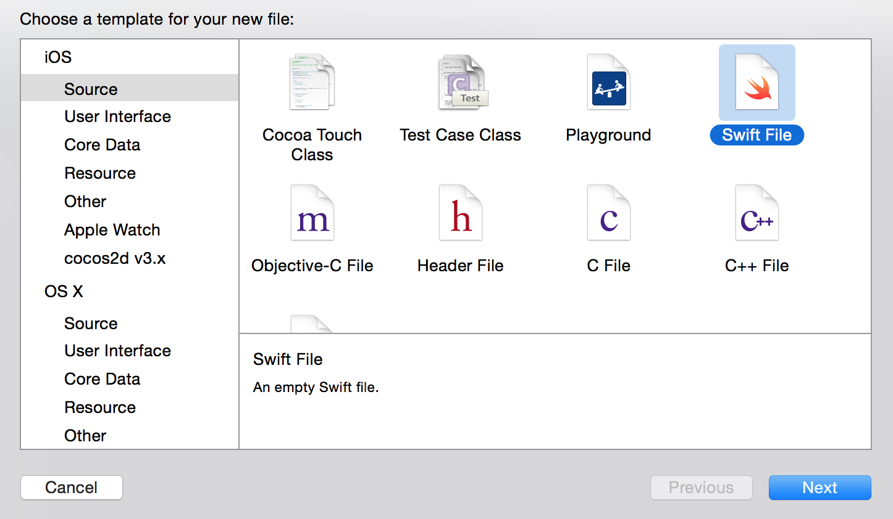
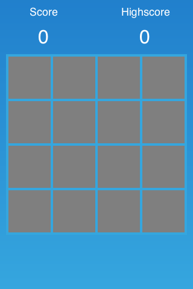
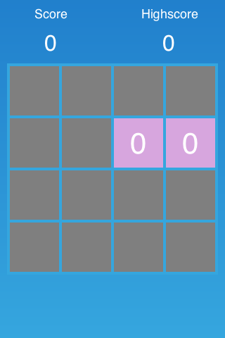

# Set up the project in Xcode

Before we start implementing the actual game logic we need to create classes and variables for the code connections we have created in SpriteBuilder.

Let's start with the `Grid` class. Select File -> New -> File, then do the following:

Since the Grid has a type of *Color Node* in SpriteBuilder it needs to inherit from *CCNodeColor*. The Swift class always needs to match the node type in SpriteBuilder.

> [action]
> Add the following to `Grid.swift`:
>
>       class Grid: CCNodeColor {
>
>       }

Create a new *Tile* class. It needs to be subclass of *CCNode*.

> [action]
> Add the following to `Tile.swift`:
>
>       class Tile: CCNode {
>
>       }

Now that we have created both classes we need to set up the variables for the connections we defined in SpriteBuilder.

> [action]
> Let's start with *MainScene*. Open *MainScene.swift* in Xcode. Add the variables below between `{` and `}` to complete the code connections:
>
>       weak var grid: Grid!
>       weak var scoreLabel: CCLabelTTF!
>       weak var highscoreLabel: CCLabelTTF!

The above lines create variables that reference the grid and both score labels that we placed in this scene using SpriteBuilder.

> [action]
> Next, open *Tile.swift* and add the following variables to complete the code connections:
>
>       weak var valueLabel: CCLabelTTF!
>       weak var backgroundNode: CCNodeColor!

> [info]
> Remember, we always use the format `weak var connectionName: ConnectionClass!` for code connections to SpriteBuilder!

Now we have set up all required code connections and you should be able to run the game for the first time. Hit the run button in Xcode and you should see this game on the iPhone simulator:

Pretty empty - but it's up and running. Next we will render 16 cells as background for our grid.

## Render a grid background

We are going to implement the background rendering in the grid class. Open *Grid.swift* in Xcode.

For *2048* we need a 4x4 grid with 16 tiles spread out with a constant margin. Since we are good developers we like to create programs that have a certain flexibility - this means we don't want our program to break when simple parameters change. An example: if we come up with a good solution it should be fairly easy to change the game and make it use a 5x5 grid instead of a 4x4 one.

This means we will have to calculate the position of each cell in code, instead of defining them initially upfront. The relevant factors for positioning the 16 cells are:

*   the size of the grid
*   the size of the tiles
*   the margin between the tiles

We are going to implement a mechanism that reads the grid size and the tile size and calculates a margin automatically. We will need to add variables and constants to our *Grid* class to store all this information.

> [action]
> Add the following variables to the `Grid` class:
>
>       let gridSize = 4
>
>       var columnWidth: CGFloat = 0
>       var columnHeight: CGFloat = 0
>       var tileMarginVertical: CGFloat = 0
>       var tileMarginHorizontal: CGFloat = 0

We create 4 CGFloat variables that store information about the grid and one constant that defines the amount of tiles in the grid - by default we assume a 4x4 grid.

Now we need to add a method that renders 16 empty cells to our grid. We will call it `setupBackground`.

> [action]
> Add the following method to the `Grid` class:
>
>       func setupBackground() {
>           var tile = CCBReader.load("Tile") as! Tile
>           columnWidth = tile.contentSize.width
>           columnHeight = tile.contentSize.height
>
>           tileMarginHorizontal = (contentSize.width - (CGFloat(gridSize) * columnWidth)) / CGFloat(gridSize + 1)
>           tileMarginVertical = (contentSize.height - (CGFloat(gridSize) * columnHeight)) / CGFloat(gridSize + 1)
>
>           var x = tileMarginHorizontal
>           var y = tileMarginVertical
>
>           for i in 0..<gridSize {
>               x = tileMarginHorizontal
>               for j in 0..<gridSize {
>                   var backgroundTile = CCNodeColor.nodeWithColor(CCColor.grayColor())
>                   backgroundTile.contentSize = CGSize(width: columnWidth, height: columnHeight)
>                   backgroundTile.position = CGPoint(x: x, y: y)
>                   addChild(backgroundTile)
>                   x += columnWidth + tileMarginHorizontal
>               }
>               y += columnHeight + tileMarginVertical
>           }
>       }

This is a lot of code, but don't worry - all of it is fairly straightforward. First we load a `Tile.ccb` to read the height and width of a single tile. Then we subtract the width of all tiles we need to render from the width of the grid to calculate the available width. Once we have the available width we can calculate the available horizontal margin between tiles. We do the same for the height and the vertical margin.

Once we know the margins we run through a two dimensional loop to create all tiles. We start at the first row (bottom) and render all columns of the first row (from left to right). Once we reach the last column we move to the next row. We repeat until we reach the last column of the last row (top right). The following image visualizes the loop that renders the tiles:

Now that you understand the rendering code we just need to call it. When working with scenes created in SpriteBuilder the method `didLoadFromCCB` is the right place to perform modifications that shall happen as soon as the scene gets initialized.

> [action]
> Let's call our new method from `didLoadFromCCB` by adding this implementation to `Grid.swift`:
>
>       func didLoadFromCCB() {
>           setupBackground()
>       }

Now the background will be rendered as soon as the `MainScene.ccb` is loaded. You can run the app now and should see following result on the screen:

Well done! This is starting to look like a real game. Next, we are going to spawn our first tiles.

## Spawn the first tiles

In this step, we will create a data structure for our grid (a 2D array) and we will add methods that will spawn tiles and add them to our data structure and visual grid. This chapter will also be a lesson about breaking a large problem down into many small problems. Whenever we need to write a complex piece of code, breaking down the problem into smaller ones should be the first step.

**The large problem:** We need to spawn a certain amount of randomly positioned tiles when our program starts. We need to add the tiles to a data structure and we need to add them visually to the grid.

**Small problems:**

*   We need the capability to spawn a random tile
*   We need to spawn **n** random tiles when the program starts
*   We need a data structure to store spawned tiles
*   We need to determine where (visually) on the grid a tile needs to be added

The next step is transforming these small problems into methods that we can implement in our program.

**Methods to solve small problems:**

*   `addTileAtColumn(:Row:)` adds a tile to the data structure and adds it to the visual grid with an animation
*   `spawnRandomTile:` determines a random position and uses the `addTileAtColumn(:Row:)` method to add a tile at that position
*   `spawnStartTiles:` calls `spawnRandomTile` **n** times
*   `positionForColumn(:Row:)` a utility method that is used by `addTileAtColumn(:Row:)` to determine where a tile needs to be added to the visual grid

As you can see, all of these methods are not too complicated - the most complicated step is breaking the big problem down into smaller problems. Before we can start implementing these methods we need to add an import statement, a constant and two variables.

> [action]
> Add this these variables to the `Grid` class:
>
>       var gridArray = [[Tile?]]()
>       var noTile: Tile? = nil

The `gridArray` is a two dimensional array that will store the tile for each index of the grid. The `noTile` variable will represent an empty cell in the `gridArray`. Because arrays in Swift are typed, we need to make `gridArray` of type `Tile?`. This will allow us to store `nil` inside of the array.

We also need to add a constant that will store how many start tiles we want to spawn.

> [action]
> Add this constant below the already existing `gridSize` constant:
>
>       let startTiles = 2

Now we can start implementing the different methods and putting the parts together!

### Determining the position for a new tile

First we are going to add the `positionForColumn(:Row:)` method. This method uses the information we stored about the grid (column sizes, margins) to calculate a point for a given tile index. The implementation is only a few lines.

> [action]
> Add this method to the `Grid` class:
>
>       func positionForColumn(column: Int, row: Int) -> CGPoint {
>           var x = tileMarginHorizontal + CGFloat(column) * (tileMarginHorizontal + columnWidth)
>           var y = tileMarginVertical + CGFloat(row) * (tileMarginVertical + columnHeight)
>           return CGPoint(x: x, y: y)
>       }

We will use this method momentarily when adding tiles to the game.

### Add a tile at a certain row and column

The next method we are going to implement is the one that adds a tile at a specified row and column.

> [action]
> Add this method the `Grid` class:
>
>       func addTileAtColumn(column: Int, row: Int) {
>           var tile = CCBReader.load("Tile") as! Tile
>           gridArray[column][row] = tile
>           tile.scale = 0
>           addChild(tile)
>           tile.position = positionForColumn(column, row: row)
>           var delay = CCActionDelay.actionWithDuration(0.3) as! CCActionDelay
>           var scaleUp = CCActionScaleTo.actionWithDuration(0.2, scale: 1) as! CCActionScaleTo
>           var sequence = CCActionSequence.actionWithArray([delay, scaleUp]) as! CCActionSequence
>           tile.runAction(sequence)
>       }

This method performs a couple of tasks. First we load the tile by loading the CCB file and storing it in a local variable. We also store this tile in the grid array. We set the scale of the tile to 0 because we want the tile to appear with a scale up animation. Then we add the child to the grid. We define the position of the tile using the `positionForColumn(:row:)` method. Then we create an action sequence that forms a spawn animation. The tile starts with a scale of 0 and is invisible. We define a action sequence that waits for 0.3 seconds and then scales the tile up to its full size in 0.2 seconds.

That's it! Now we have a method to add a tile at any position in the game. Without much more code, we'll be spawning random tiles!

### Spawning a random tile

The next method that we are going to add will determine a random free position on the grid to spawn a new tile. The easiest way to do this is having a loop that continues generating a random tile index until it finds a free position on the grid. *Note: this is not the most efficient way to do this; once there are only a few spots left on the grid, the program will generate many random positions that will already be occupied by other tiles. However, this approach is absolutely fine for this type of game.*

> [action]
> Add the `spawnRandomTile` method to the `Grid` class:
>
>       func spawnRandomTile() {
>           var spawned = false
>           while !spawned {
>               let randomRow = Int(CCRANDOM_0_1() * Float(gridSize))
>               let randomColumn = Int(CCRANDOM_0_1() * Float(gridSize))
>               let positionFree = gridArray[randomColumn][randomRow] == noTile
>               if positionFree {
>                   addTileAtColumn(randomColumn, row: randomRow)
>                   spawned = true
>               }
>           }
>       }

This method picks a random position and checks if it is occupied. We test occupation by checking if the tile for the index is a `noTile` (these represent empty slots). If the position is occupied the loop continues and generates a new random number, if the picked position is free the loop terminates and the method uses the `addTileAtColumn` to add a tile at that position. Now all we need to do is call this method multiple times and we will be able to spawn our start tiles!

### Spawn multiple start tiles

Now we are going to call the `spawnRandomTile` method for each start tile.

> [action]
> Add this method to the `Grid` class:
>
>       func spawnStartTiles() {
>           for i in 0..<startTiles {
>               spawnRandomTile()
>           }
>       }

Very straightforward! One last change and we can finally run the game and watch the tiles spawn.

> [action]
> Change your `didLoadFromCCB` method to look like this:
>
>       func didLoadFromCCB() {
>           setupBackground()
>
>           for i in 0..<gridSize {
>               var column = [Tile?]()
>               for j in 0..<gridSize {
>                   column.append(noTile)
>               }
>               gridArray.append(column)
>           }
>
>           spawnStartTiles()
>       }

We setup `gridArray` and store the `noTile` value for each index. Then we call `spawnStartTiles` to get our first two tiles spawned.

**Now it is time to run the app and check if everything worked out.** When the app started you should see something similar to this:

We set up the basic project in this step. We added the data model for our game and already included a system that allows to add tiles with animations. **Well done!**

You can now move on to part 2 of the tutorial where we will add user interaction and tile movement to this game!
