In the second part of this tutorial we have added user interaction, tile movement and tile merging. We implemented all the basic mechanics of the game. In this part of the tutorial we will add a win and a lose condition to the game, keep track of scores and add some finishing touches to our very own version of *2048!*

We will start with adding some scores to our game.

# Keep track of scores

In *2048* the player's score increases when two tiles merge. We are not yet keeping track of any scores in our version of *2048.* Let's change that right away!

We will start by displaying the score of the current game. Later on we will also keep track of the player's overall highscore.

## Keeping track of current game's score

First of all we need a new variable to store the current score of the game. It could make sense to add an entirely new game class to our program that would encapsulate all the information about our game. For a *2048* game however, there is very little information to be stored. To not add unnecessary complexity we will store the current game score as a property of the *Grid*, which is absolutely fine for this type of game.

> [action]
> Add this variable to *Grid*:
>
>       var score: Int = 0

We will use this new integer variable to store the score of the game.

As mentioned above, the score of the game increases when two tiles merge. The score increases by the combined value of both tiles. For example a merge between a "4" tile and another "4" tile will result in 8 points.

The best place to add this functionality is the method where we perform the merge between to tiles: *mergeTilesAtindex.* 

> [action]
> Add a line to increase the score to the beginning of *mergeTilesAtindex* in *Grid*:
> 
>       var mergedTile = gridArray[x][y]!
>       var otherTile = gridArray[otherX][otherY]!
>       score += mergedTile.value + otherTile.value
> 
> **Attention:** you should only add the line that increases `score`!

Now we are successfully keeping track of the current score of the game.

At the moment the player will not see that we are keeping track of the score. We are updating a variable but we are never displaying the new score in the game. You maybe remember that we set up a score and a highscore label in one of the first steps of this tutorial. Both labels are part of the *MainScene*. We will have to add the code that updates the score label to *MainScene*.

<!--consider updating to KVO in MainScene on score in Grid -->

## Displaying the new score

The change we need to make is relatively simple. `Grid` should always have a reference to `MainScene` through `parent`. `parent` gets set when `Grid` is added as a child of `MainScene`. All we need to do is create a `didSet` property observer for `score` so we can update `scoreLabel`.

> [action]
> Change the following line in `Grid.swift`:
> 
>       var score: Int = 0
> 
> to:
> 
>       var score: Int = 0 {
>           didSet {
>               var mainScene = parent as! MainScene
>               mainScene.scoreLabel.string = "\(score)"
>           }
>       }

 **Well done!** Now you can play the game and should see the score increasing:

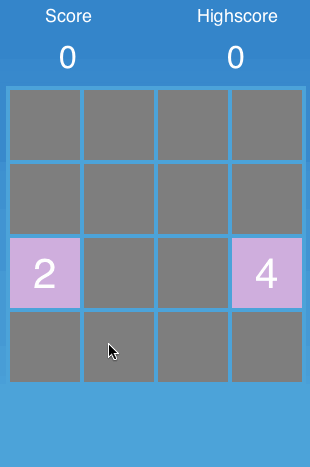

Now let's determine when a game is over so that we can store a highscore!

# Add a win and a lose condition

A player loses in *2048* when they cannot perform any further move. This situation occurs when the grid is full and none of the existing tiles can be merged. We need to detect this situation so that we can end the game. The player wins the game if they reach the "2048" tiles.

The best place to detect if the losing condition occurred in the game is the *nextRound* method. In the *nextRound* method we spawn a new random tile. After we have spawned a tile we can check if the grid is full and if any further moves are possible. If no moves are possible we end the game.

The best place to check the winning condition is in the *mergeTilesAtindex* method. That is the method where we actually perform the merge between two tiles and determine the new value of the merged tile. If the new value is *2048* we know that the player has won the game.

Let's get started by implementing the win condition.

## Implementing the win condition

Let's start by setting up a constant for the value of the final tile. 

> [action]
> Add this constant to the other constants in the `Grid` class:
> 
>       let winTile = 8

For debugging purposes we will set the `winTile` to be `8`. This way it will be a lot easier to test if the win condition works, reaching "2048" can take quite a lot of time ;)

Now we will need to check if this win condition occurs. 

> [action]
> Add the following lines to `Grid` to the *mergeTilesAtindex* method after the line that sets *mergedThisRound* to *true*:
> 
>       if (otherTile.value == winTile) {
>           win()
>       }

Once the value of the merged tile reaches the value of the *WIN_TILE* we call the *win* method!

> [action]
> Add the *win* method to *Grid*:
> 
>       func win() {
>           endGameWithMessage("You win!")
>       }

All we do in the *win* method is calling the *endGameWithMessage* method. In our game most tasks that need to performed to reset a game will be the same for won and lost games (reset game, store new highscore, etc.). Therefore it makes sense to extract this functionality into the *endGameWithMessage* method instead of duplicating the code.

We simply pass a different text to method for lost or won games.

> [action]
> Add the *endGameWithMessage* method to *Grid*:
> 
>       func endGameWithMessage(message: String) {
>           println(message)
>       }

For now, all we are doing in this method is logging to the console for debugging purposes. Now you are ready to test this new feature. Run the game. Merge tiles until you reach the "8" tile, then you should see **"You win!"** appear in the Xcode console.

Well done! Now let's implement the losing condition.

## Implementing the losing condition

Detecting the losing situation is a little more complex then a win situation. A losing situation occurs when the entire grid is filled with tiles and no merges between these tiles are possible. Then there is no possible move left in the game. We will have to add code to detect such a situation in our game. On a high level with have do to the following: in the *nextRound* method we need to check if the player is able to perform a move or not. If the player cannot move the tiles in any direction we need to end the game.

> [action]
> Add the following lines to the end of the *nextRound* method in *Grid*:
> 
>       if !movePossible() {
>           lose()
>       }

So far, so simple. If no move is possible, the player loses. We now need to add the *movePossible* and *lose* methods.

Let's start with the *movePossible* method. The *movePossible* method reads the entire grid to determine if any moves are possible. It returns a boolean value that defines if moves are possible or not.

> [action]
> Add the *movePossible* method to *Grid*:
> 
>       func movePossible() -> Bool {
>           for i in 0..<gridSize {
>               for j in 0..<gridSize {
>                   if let tile = gridArray[i][j] {
>                       var topNeighbor = tileForIndex(i, y: j+1)
>                       var bottomNeighbor = tileForIndex(i, y: j-1)
>                       var leftNeighbor = tileForIndex(i-1, y: j)
>                       var rightNeighbor = tileForIndex(i+1, y: j)
>                       var neighbors = [topNeighbor, bottomNeighbor, leftNeighbor, rightNeighbor]
>                       for neighbor in neighbors {
>                           if let neighborTile = neighbor {
>                               if neighborTile.value == tile.value {
>                                   return true
>                               }
>                           }
>                       }
>                   } else { // empty space on the grid
>                       return true
>                   }
>               }
>           }
>           return false
>       }

This method iterates over the entire grid and selects each index. For each index the loop checks if the position on the grid is free. If the position is free that means the player can definitely perform a move, so we immediately return *true*. If the index is not empty, we check all the neighbors of the tiles and see if they have the same value as the tile at the current index, if that is the case this means the tiles could be merged, so we can return *true* because there is definitely a possible move.

If *every* index is occupied and none of the neighbours of a tile has the same value, we will complete the iteration through the grid and return *false* at the end. This means that the player has no possible move left and will lose the game.

To access a tile at an index we use a utility method which we need to add to our program: *tileForIndex*. The *tileForIndex* method simply takes an index and returns the tile at that grid position.

> [action]
> Add the *tileForIndex* method to the *Grid* class:
> 
>       func tileForIndex(x: Int, y: Int) -> Tile? {
>           return indexValid(x, y: y) ? gridArray[x][y] : noTile
>       }

This method either returns a *noTile* in case an invalid index was provided. Otherwise it picks the relevant tile from the *gridArray*.

Now there's one last method which we need to add to actually test the lose condition:the *lose* method. We are already calling the *lose* method from the *nextRound* method.

> [action]
> Add the method to *Grid*:
> 
>       func lose() {
>           endGameWithMessage("You lose!")
>       }

Now we have put the parts together. In the *nextRound* method we check wether a move is possible or not, using the *movePossible* method. If no move is possible we call the *lose* method that uses the *endGameWithMessage* to end the game and display a lose message.

As you may remember the current implementation of *endGameWithMessage* just logs a message to the console.

We have one little issue left, currently it is really difficult to lose in the game. It will take many moves and result in a very long debugging cycle.

> [action]
> To make losing easier open *Tile.swift* and change the line in the *didLoadFromCCB* method that generates a random number to:
> 
>       value = Int(CCRANDOM_MINUS1_1() + 201) * 2

Now the tile numbers will be so widely spread that it is very easy to lose. **Run the new version of the game.** After a couple of moves your grid should look like this:

Additionally you should see a log message "**You lose!"** in the Xcode console. We now can detect if a player wins or loses the game!

Now that we have tested the new functionality we can reset the values that we chose for debugging.

> [action]
> Change the line that sets the value in the *didLoadFromCCB* method of *Tile.swift* back to:
> 
>       value = Int(CCRANDOM_MINUS1_1() + 2) * 2
> 
> Additionally change the *winTile* constant in *Grid* to:
> 
>       let winTile = 2048

Great! Another step toward completing the game. Next we are going to take care of storing players' highscores.

# Keep track of highscores

The score of the current game only needs to be stored while the game is going on. That's why we can use a simple variable to store the *score*. The highscore however should be persistent. If a player restarts the app the highest score from any previous game should be available.

In iOS the easiest way to store simple information persistently is using *NSUserDefaults*. *NSUserDefaults* provides a very simple interface to store key-value information.

A good place to update the highscore is when the game ends.

Add these lines to the end of *endGameWithMessage*:

        NSNumber *highScore = [[NSUserDefaults standardUserDefaults] objectForKey:@"highscore"];
        if (self.score > [highScore intValue]) {
            // new highscore!
            highScore = [NSNumber numberWithInt:self.score];
            [[NSUserDefaults standardUserDefaults] setObject:highScore forKey:@"highscore"];
            [[NSUserDefaults standardUserDefaults] synchronize];
        }

What are we doing in these couple of lines? We are reading the current highscore from *NSUserDefaults.* If the score of the current game is a new highscore we store the new value in *NSUserDefauts*. We call the *synchronize* method on *NSUserDefaults* to write these changes to disk immediately.

Now we are storing the highscore but we are not updating the label that displays the highscore yet. You might remember that we had a similar problem when displaying the score.

*MainScene* is the class that takes care of displaying the labels. That is where we need to add the code to update the highscore label.

> [action]
> Let's first add a method to *MainScene* that takes care of reading the newest highscore and updating the label to display it:
> 
>       func updateHighscore() {
>           var newHighscore = NSUserDefaults.standardUserDefaults().integerForKey("highscore")
>           highscoreLabel.string = "\(newHighscore)"
>       }

We need to call this method in two situations:

*   When the app starts - to display the latest highscore
*   When the highscore gets updated

> [action]
> Add the following lines to *didLoadFromCCB* in *MainScene*:
> 
>       NSUserDefaults.standardUserDefaults().addObserver(self, forKeyPath: "highscore", options: .allZeros, context: nil)
>       updateHighscore()

We are doing two things here. We observe the highscore, just as we observe the score value of the *Grid*. This means whenever the highscore stored in the *NSUserDefaults* changes this class will be notified (the *observeValueForKeyPath* will be called).

<!--TODO: explain KVO-->

The second thing we do is calling the *updateHighscore* method directly from *didLoadFromCCB* to display the latest highscore once the app starts.

> [action]
> Now that we are observing a variable we need to add an *observeValueForKeyPath* method in *MainScene*:
> 
>       override func observeValueForKeyPath(keyPath: String, ofObject object: AnyObject, change: [NSObject : AnyObject], context: UnsafeMutablePointer<Void>) {
>           if keyPath == "highscore" {
>               updateHighscore()
>           }
>       }

You can see that we are now reacting to changes of `score` and `highscore`. If the highscore changes we call *updateHighscore* and refresh the displayed highscore in the game.

Now you can run the new version of the game and see how the highscore is stored and displayed in the game:

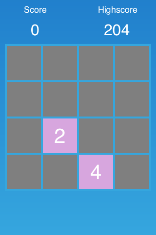

# Add a Game Over screen

Our game can already detect when a player has won or lost. However, we are currently only logging a message to the console. In this step we are going to add a game over screen with a restart button.

To start with this step we will create a new CCB file for the Game Over screen in SpriteBuilder.

Open the SpriteBuilder project and create a new CCB file:

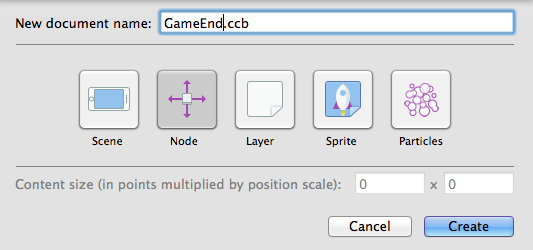

Set the *root node size* to `(320, 200)` and the *anchor point* to `(0.5, 0.5)`:

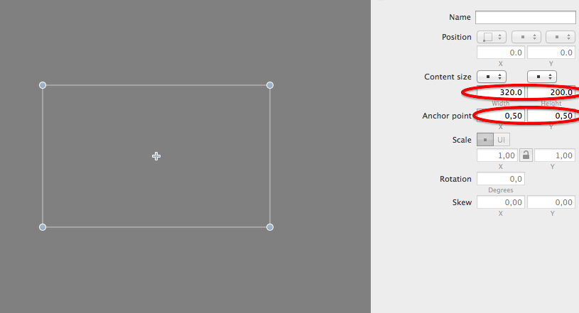

Add a *CCNodeColor* to this node:

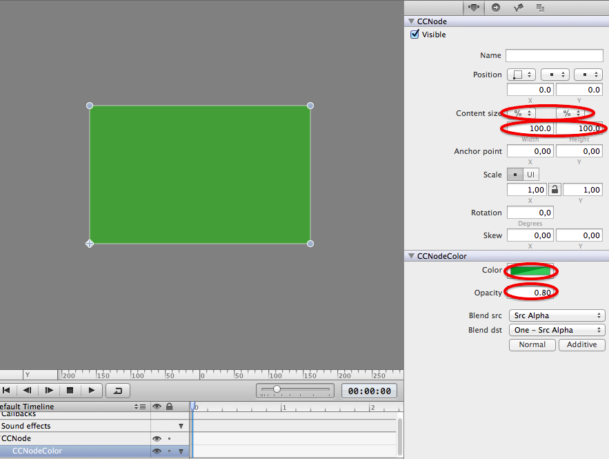

Set the *width* and the *height* to `100%` of the parent container. Set the *background color* to `green` and the *opacity* to `0.8`. Now we have a green slightly transparent background for our game over screen.

Now we'll need to add two labels to display a game over message and the score that the player has achieved. Additionally we are going to add a button to restart the game.

Add two labels and a button to the node so that your game end screen looks similar to this:

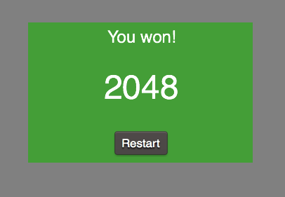

Now we need to set up some code connections. We need to change the text label that displays the win/lose text and we need to update the score that is displayed. Additionally we need to link a method to the `Restart` button.

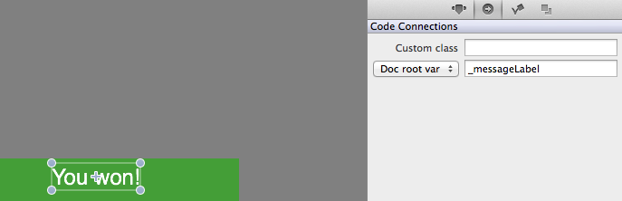

Link the top label to a *messageLabel* variable.

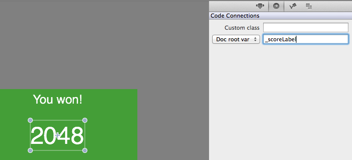

Link the displayed score to a variable called *scoreLabel*.

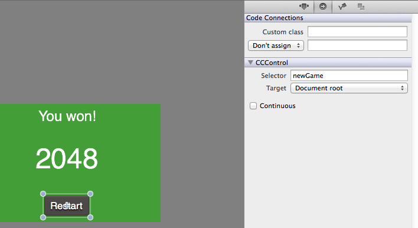

Set up a selector called `newGame` for the `Restart` button.

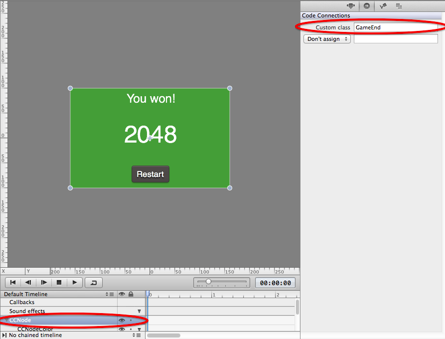

Finally, set up a custom class called *GameEnd* for the root node.

Now we are done with the setup in SpriteBuilder. **Publish the project and switch to Xcode.**

In Xcode we need to create the *GameEnd* class that is linked to the CCB file we just created in SpriteBuilder:

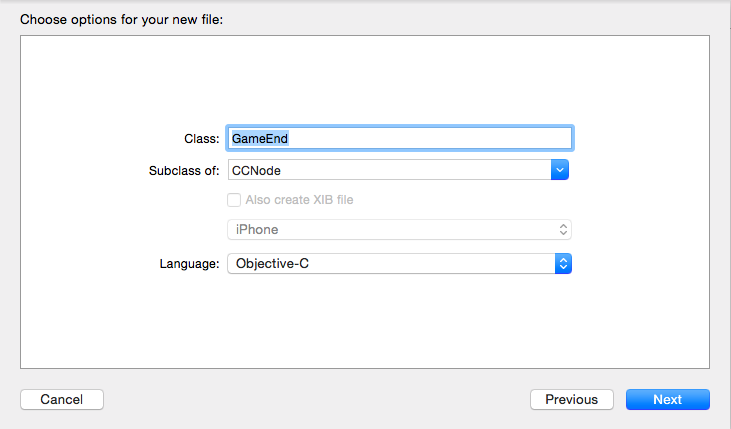

Next, we need to set up the variables and methods that we have linked in our SpriteBuilder project.

> [action]
> Set up the `GameEnd` class with our code connections:
> 
>       class GameEnd: CCNode {
>           weak var messageLabel: CCLabelTTF!
>           weak var scoreLabel: CCLabelTTF!
> 
>       }
> 
> Next, add the *newGame* method that will be called when a user hits the restart button on the *endGame* screen:
> 
>       func newGame() {
>           var mainScene: CCScene = CCBReader.loadAsScene("MainScene") as CCScene
>           CCDirector.sharedDirector().replaceScene(mainScene)
>       }

This method simply reloads the *MainScene* which restarts the entire game.

The game over screen we are implementing right now will be presented by the *Grid* once a game ends. As you may remember the *Grid* provides two different messages, depending on the outcome of the game. We need to provide a way for the *Grid* to inform the game over screen which text should be displayed. Additionally it would be great if the final score of the game could be handed to the game over screen in the same method.

> [action]
> Add the implementation of this method to *GameEnd*:
> 
>       func setMessage(message: String, score: Int) {
>           messageLabel.string = message
>           scoreLabel.string = "\(score)"
>       }

All we are doing is updating the content of both labels.

Now we can move on to the final step of implementing the game end screen - presenting it!

Now we need to add some code to display the *GameEnd* as a popup once a game ends. The place to do that is the *endGameWithMessage* method. 

> [action]
> Add the following lines to the beginning of the *endGameWithMessage* method in *Grid*:
> 
>       var gameEndPopover = CCBReader.load("GameEnd") as! GameEnd
>       gameEndPopover.positionType = CCPositionType(xUnit: .Normalized, yUnit: .Normalized, corner: .BottomLeft)
>       gameEndPopover.position = ccp(0.5, 0.5)
>       gameEndPopover.zOrder = Int.max
>       gameEndPopover.setMessage(message, score: score)
>       addChild(gameEndPopover)

 **Now everything is in place!** We are setting the game end screen up and presenting it when a game terminates. You should now test this feature (hint: changing the *winTile* value makes testing a lot easier). When you win or lose a game you should see a result similar to this:

Basically the game is complete now! There's one minor detail missing: changing the color of tiles depending on their value. That's the last polishing step in this tutorial.

# Polishing: colorful tiles

This is the last step and it isn't going to be very complicated. You only need to add a large switch-statement to the *Tile* class.

> [action]
> Add the following method to `Tile`:
> 
>       func updateColor() {
>           var backgroundColor: CCColor
>           
>           switch value {
>           case 2:
>               backgroundColor = CCColor(red: 20.0/255, green: 20.0/255, blue: 80.0/255)
>               break
>           case 4:
>               backgroundColor = CCColor(red: 20.0/255, green: 20.0/255, blue: 140.0/255)
>               break
>           case 8:
>               backgroundColor = CCColor(red:20.0/255, green:60.0/255, blue:220.0/255)
>               break
>           case 16:
>               backgroundColor = CCColor(red:20.0/255, green:120.0/255, blue:120.0/255)
>               break
>           case 32:
>               backgroundColor = CCColor(red:20.0/255, green:160.0/255, blue:120.0/255)
>               break
>           case 64:
>               backgroundColor = CCColor(red:20.0/255, green:160.0/255, blue:60.0/255)
>               break
>           case 128:
>               backgroundColor = CCColor(red:50.0/255, green:160.0/255, blue:60.0/255)
>               break
>           case 256:
>               backgroundColor = CCColor(red:80.0/255, green:120.0/255, blue:60.0/255)
>               break
>           case 512:
>               backgroundColor = CCColor(red:140.0/255, green:70.0/255, blue:60.0/255)
>               break
>           case 1024:
>               backgroundColor = CCColor(red:170.0/255, green:30.0/255, blue:60.0/255)
>               break
>           case 2048:
>               backgroundColor = CCColor(red:220.0/255, green:30.0/255, blue:30.0/255)
>               break
>           default:
>               backgroundColor = CCColor.greenColor()
>               break
>           }
>           
>           backgroundNode.color = backgroundColor
>       }
> 
> Now call this method from your `didSet` property observer on `value`:
> 
>       var value: Int = 0 {
>           didSet {
>               valueLabel.string = "\(value)"
>               updateColor()
>           }
>       }

All this switch-case does is mapping a tile number to a color. Now your game should look a little more colorful:

**You're done!** Congratulations, you have come a really long way. I hope you enjoyed and once again learned a lot more about iOS and game development!

Reminder: you can find [the entire project on GitHub](https://github.com/MakeSchool/2048-SpriteBuilder-Swift).
