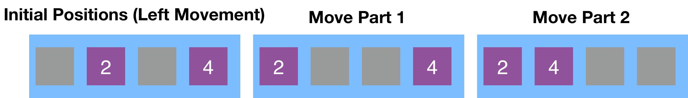
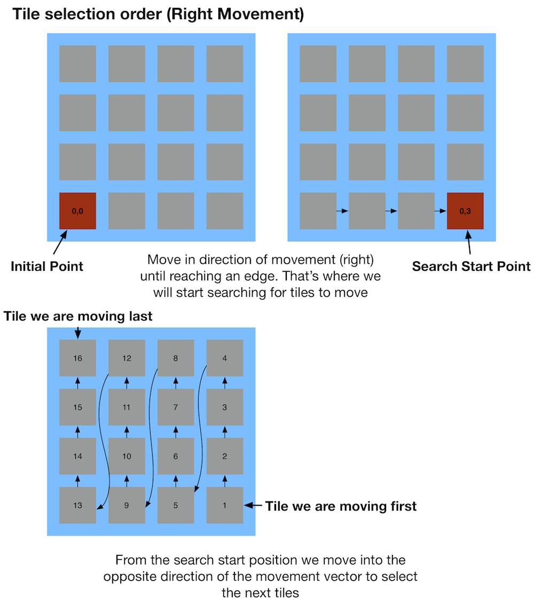
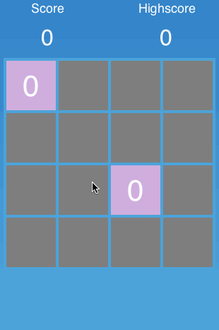

So far in this tutorial, we've set up the basic project, rendered a grid and implemented multiple methods to spawn random tiles when the game starts up. In this part, we are going to add user interaction to the game - we will start moving tiles!

#Move the tiles

We are now going to implement some exciting but also some slightly complicated functionality - tile movement. The basic rules of 2048 are:

*   the player can move all tiles in the grid in 4 different directions
*   each tile moves as far is it can in the direction the user chose
*   the tiles are moved in a specific order. Example: when moving to the left the left most tile in each row is moved first, then the second most left tile, etc.
*   tile movement is limited by the border of the grid and by other tiles. Tiles cannot move to grid slots that are already occupied by other tiles. The only exception is that two tiles can be merged when they have the same value.
*   tiles can only be merged once per move. Tiles that already have been merged in a move cannot be merged again

We will not implement all of these rules at once. We will divide the functionality into smaller chunks. Once again, **it is important to break the big problem down into smaller ones.**

#Moving all tiles to the edges

In the first step we will be moving all tiles as far as possible in the selected direction, ignoring other tiles that might be in the way. To implement movement in general we will need to add some sort of input mechanism to the game.

#Adding gesture recognizers

For this game it will be most intuitive for the user to swipe in the direction in which the tiles shall move. Luckily iOS provides a very simple API to capture swipes. We can use the `UIGestureRecognizer`.

> [action]
> Add this method to the `Grid` class:
>
>       func setupGestures() {
>           let swipeLeft = UISwipeGestureRecognizer(target: self, action: "swipeLeft")
>           swipeLeft.direction = .Left
>           CCDirector.sharedDirector().view.addGestureRecognizer(swipeLeft)
>
>           let swipeRight = UISwipeGestureRecognizer(target: self, action: "swipeRight")
>           swipeRight.direction = .Right
>           CCDirector.sharedDirector().view.addGestureRecognizer(swipeRight)
>
>           let swipeUp = UISwipeGestureRecognizer(target: self, action: "swipeUp")
>           swipeUp.direction = .Up
>           CCDirector.sharedDirector().view.addGestureRecognizer(swipeUp)
>
>           let swipeDown = UISwipeGestureRecognizer(target: self, action: "swipeDown")
>           swipeDown.direction = .Down
>           CCDirector.sharedDirector().view.addGestureRecognizer(swipeDown)
>       }
>
> And call it from the end of `didLoadFromCCB`:
>
>       setupGestures()

This code will add 4 listeners that listen for swipes in 4 different directions. Gesture recognizers need to be added to a *UIView*. The main *UIView* in a Cocos2D application is the OpenGL view that is used to render the entire content of a Cocos2D app. We access this main *UIView* through the *view* property of *CCDirector*. The *UISwipeGestureRecognizer* allows to associate one method with each swipe direction. Input handling in iOS can be this simple!

Now we need to implement the methods that we have linked to our gesture recognizers.

> [action]
> Add the following for methods to the `Grid` class:
>
>       func swipeLeft() {
>           println("Left swipe!")
>       }
>
>       func swipeRight() {
>           println("Right swipe!")
>       }
>
>       func swipeUp() {
>           println("Up swipe!")
>       }
>
>       func swipeDown() {
>           println("Down swipe!")
>       }

For now we are just adding log statements to these methods. We want to be sure that the swipe detection works before moving forward. Run the app and check the console for log messages to appear. If you swipe in any direction you should see one of the four log messages in the Xcode console.

Now that this works as expected we can replace our test implementation with some actual code. We will not implement the tile movement directly in the gesture recognizer callbacks since that would result in a lot of duplicate and badly reusable code. Basically all of the methods would have the same code, the only difference would be the direction of the move. Instead we will choose an elegant solution and will have the gesture recognizer callbacks call a `move` method and providing the direction in which the tiles should move.

To express the direction in which the tiles shall move we will use *CGPoint*. A *CGPoint*  is ideal to express a movement vector because it has an X and Y component. A movement to the left for example can be expressed as (-1,0).

> [action]
> Change the implementation of the swipe callback methods to call the move methods and pass the according vector as a parameter:
>
>       func swipeLeft() {
>           move(CGPoint(x: -1, y: 0))
>       }
>
>       func swipeRight() {
>           move(CGPoint(x: 1, y: 0))
>       }
>
>       func swipeUp() {
>           move(CGPoint(x: 0, y: 1))
>       }
>
>       func swipeDown() {
>           move(CGPoint(x: 0, y: -1))
>       }

Great! Now we need to implement the *move* method that we are calling here. The *move* method is the most complicated part of the *2048* game so grab your favorite hot drink. We're going to dive right into it!

#Implementing the move method

This is a good time to do some recap on the rules that determine the tile movement in *2048*. The most important one is the order in which the tiles are moved. Here's an illustrated example of a movement to the left, that shows how each individual tile is moved:

When moving to the left, the left most tile is moved first. When moving to the right the right most tile is moved first, etc. Then the second most left/right tile is moved, etc. This works the same way for moving tiles up or down. In this case the tile with number "2" is moved first. Since there are no tiles in the way it is moved entirely to the left side. In the second part of the movement tile "4" is moved. It cannot be moved entirely to the left because tile "2" occupies this spot. That's why it is moved to the second most left spot. *Note: the player will never see the intermediate step (Move Part 1) of the tile movement it is only illustrated here to explain the rules of 2048.*

These rules basically mean that implementing tile movement is a three step process:

1.  Select the tile that needs be moved
2.  Determine how far this tile can be moved
3.  Repeat 1 and 2 until each tile in the game has been selected

It is fairly tricky to come up with a generic solution for this. We need a method that correctly determines in which order the tiles need to be moved, depending on which of the four directions have been selected.

I will provide this first version of the move method for you and walk through it line for line explaining the details.

> [action]
> Add the following *move* method to the `Grid` class:
>
>       func move(direction: CGPoint) {
>           // apply negative vector until reaching boundary, this way we get the tile that is the furthest away
>           // bottom left corner
>           var currentX = 0
>           var currentY = 0
>           // Move to relevant edge by applying direction until reaching border
>           while indexValid(currentX, y: currentY) {
>               let newX = currentX + Int(direction.x)
>               let newY = currentY + Int(direction.y)
>               if indexValid(newX, y: newY) {
>                   currentX = newX
>                   currentY = newY
>               } else {
>                   break
>               }
>           }
>           // store initial row value to reset after completing each column
>           var initialY = currentY
>           // define changing of x and y value (moving left, up, down or right?)
>           var xChange = Int(-direction.x)
>           var yChange = Int(-direction.y)
>           if xChange == 0 {
>               xChange = 1
>           }
>           if yChange == 0 {
>               yChange = 1
>           }
>           // visit column for column
>           while indexValid(currentX, y: currentY) {
>               while indexValid(currentX, y: currentY) {
>                   // get tile at current index
>                   if let tile = gridArray[currentX][currentY] {
>                       // if tile exists at index
>                       var newX = currentX
>                       var newY = currentY
>                       // find the farthest position by iterating in direction of the vector until reaching boarding of
>                       // grid or occupied cell
>                       while indexValid(newX+Int(direction.x), y: newY+Int(direction.y)) {
>                           newX += Int(direction.x)
>                           newY += Int(direction.y)
>                       }
>                       if newX != currentX || newY != currentY {
>                           moveTile(tile, fromX: currentX, fromY: currentY, toX: newX, toY: newY)
>                       }
>                   }
>                   // move further in this column
>                   currentY += yChange
>               }
>               currentX += xChange
>               currentY = initialY
>           }
>       }

That's a lot of code to digest, but basically it just implements the movement pattern that we have discussed earlier - let's take a close look at it.

#A closer look

The `move` method get's the movement direction as a *CGPoint*.

We start the method with searching for the tile that should be moved first. We start at index (0, 0), which is the bottom left corner of the grid. We then move into the direction of the movement vector. We keep on moving into the direction of the movement vector until we hit an invalid index. We check that by using the `indexValid` method which we are going to write later on. For example, when the move method would be called with a top direction, we would first move entirely to the top of the grid and start searching for the first tile to move from there. We store the current position on the grid in the `currentX` and `currentY` variables; these two variables basically have the function of a cursor. After completing this first step, `currentX` and `currentY` contain the position on the grid from which we will start searching for tiles to move.

From this initial position we search column for column for the first tile to move. We start at `currentY` in each column, which is either the top or bottom edge of the grid depending on the movement direction. Inside each column, we move into the opposite y direction of the movement vector. Once we complete a column, we move to the next column that is in the opposite x direction of the movement vector.

We capture the initial y position for each column in the variable `initialY`. We store the x and y movement direction in the variables `xChange` and `yChange`. These variables describe in which direction we move over the grid. Since the movement direction will always only be either in x or in y direction, either x or y will be 0. For example when moving to the left, the `yChange` will be 0 because the y component of the movement direction is 0. We iterate through the grid with the inverted movement direction. However, it is only important to invert the movement direction for the part of the direction that is **not 0.** So for a movement to the left it is important that we select tiles beginning at the left corner and moving to the right. However, it is irrelevant if we start in the top row and move to the bottom or do it the other way round. However, `xChange` and `yChange` are both not allowed to be 0, because we use them to iterate through our grid. So whichever of these two values is 0 will be set to 1. This way we ensure that we iterate through all rows and columns.

When wrapping your head around this the first time, it can be very difficult to understand, so we have added an illustration to explain the concept further.

The following figure illustrates how we find the start position from which we start iterating through the tiles and how exactly we iterate through the tiles.

The two top images show how the first loop looks for where in the grid it should start selecting tiles.

The bottom image illustrates how the second loop iterates through all tiles from the starting position determined by the first loop.

For this example we assume a movement to the right:

Now you should understand:

*   how we find the start position for selecting tiles
*   in which order we iterate through all the tiles of the grid

The last open question is, **how is the movement of each individual tile implemented?**

This happens in the most inner *while* loop of the *move* method. Once we have selected an index on the grid and ensured that we have a tile stored at that index, we move that tile as far as possible. We apply the movement vector on the selected tile until we reach an invalid index. This is the section of the move method that implements the actual tile movement:

                // get tile at current index
                if let tile = gridArray[currentX][currentY] {
                    // if tile exists at index
                    var newX = currentX
                    var newY = currentY
                    // find the farthest position by iterating in direction of the vector until reaching boarding of
                    // grid or occupied cell
                    while indexValidAndUnoccupied(newX+Int(direction.x), y: newY+Int(direction.y)) {
                        newX += Int(direction.x)
                        newY += Int(direction.y)
                    }
                    if newX != currentX || newY != currentY {
                        moveTile(tile, fromX: currentX, fromY: currentY, toX: newX, toY: newY)
                    }
                }

As you can see we have a `while` loop that moves the selected tile as far as possible in the direction of the movement vector. It terminates once the tile reaches one of the edges of the grid.

After the loop terminates we check if the position of the selected tile has changed. For example, if the selected tile already is located left edge of the grid and we want to move it to the left, the position will not change. Only if the position changed we call the `moveTile` method. The `moveTile` method will update the position of the tile in the `gridArray` and move the tile visually with an animation.

It's a lot of code, but basically the three step process described earlier is:

1.  Select the tile that needs be moved next
2.  Determine how far this tile can be moved
3.  Repeat 1 and 2 until each tile in the game has been selected

Now all that is left to do is adding the `moveTile` and `indexValid` methods that we are using in our implementation of the `move` method.

#Adding the moveTile and indexValid method

Good news: the methods we are going to add in this step are lot shorter than the `move` method.

Let's start with the `indexValid` method. The `indexValid` method will receive a index position and will return a *Bool* value that describes wether the provided index is valid (within the grid) or not.

> [action]
> Add the `indexValid` method to the `Grid` class:
>
>       func indexValid(x: Int, y: Int) -> Bool {
>           var indexValid = true
>           indexValid = (x >= 0) && (y >= 0)
>           if indexValid {
>               indexValid = x < Int(gridArray.count)
>               if indexValid {
>                   indexValid = y < Int(gridArray[x].count)
>               }
>           }
>           return indexValid
>       }

All this method does is checking wether the index is within the bounds of the two dimensional array.

> [action]
> Now you need to add the `moveTile` method to the `Grid` class:
>
>       func moveTile(tile: Tile, fromX: Int, fromY: Int, toX: Int, toY: Int) {
>           gridArray[toX][toY] = gridArray[fromX][fromY]
>           gridArray[fromX][fromY] = noTile
>           let newPosition = positionForColumn(toX, row: toY)
>           let moveTo = CCActionMoveTo(duration: 0.2, position: newPosition)
>           tile.runAction(moveTo)
>       }

The `moveTile` method receives the tile that should be moved, the old index, and the new index as method parameters. The first thing we do in this method is changing the position of the tile in the `gridArray`. We add the tile to the new index and remove the tile from the old index.

Then we take care of updating the UI so that a player sees the tile moving across the grid. Here we use the `positionForColumn` method to get the new x and y coordinates for this tile on the grid. We then use a *CCActionMoveTo* to animate the movement of the tile to that new position.

You have completed a huge amount of steps so far:

*   Added gesture recognizers
*   Added gesture recognizer callbacks
*   Added a complex `move` method
*   Added a `indexValid` method
*   Added a `moveTile` method

Now it's once again time to run the game and take a look at the results. You should be able to move the tiles from one edge to another by swiping in that direction:

**Well done!** Now the game already looks a lot like 2048. As you can see in the little demo above, tiles can overlap at the moment. Fixing this is the next little challenge we are going to tackle!
