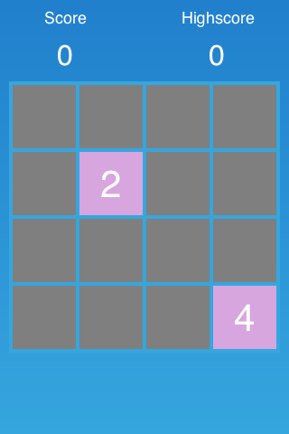
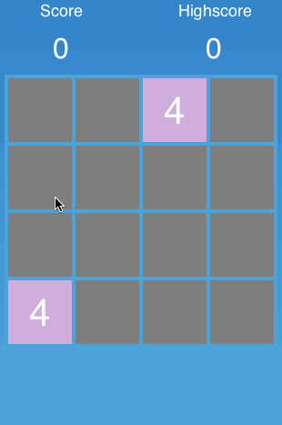
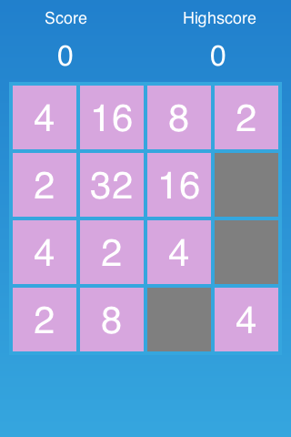
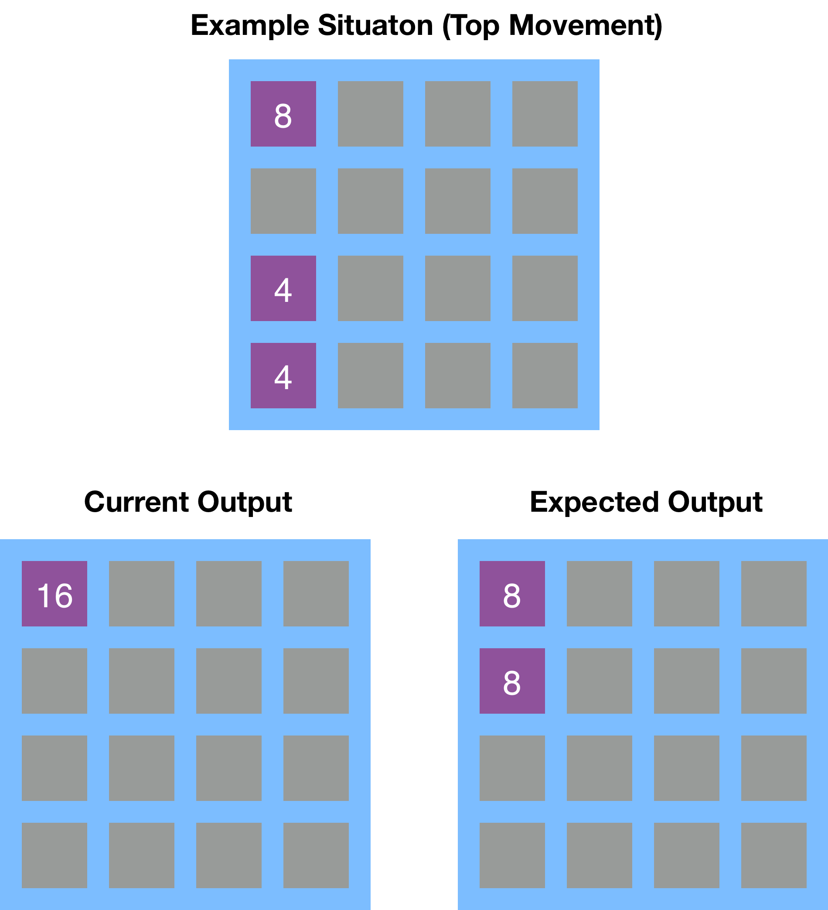

In this section, you'll implement the basic gameplay of 2048.

#Avoid that tiles overlap

Our current mechanism moves each tile in the direction of the movement until it reaches an invalid index. What the original game does is moving each tile until it reaches an invalid index **or** an occupied tile. This means we need an extension of our test in the `indexValid` method.

Instead of changing the `indexValid` method we will be adding a new method called `indexValidAndUnoccupied`. The `indexValid` method is used in multiple places that only need to check if a value is within the boundaries of the `gridArray` and that do not care about occupied or unoccupied cells, so we need to keep that method.

> Add the new `indexValidAndUnoccupied` method to the `Grid` class:
>
>       func indexValidAndUnoccupied(x: Int, y: Int) -> Bool {
>           var indexValid = self.indexValid(x, y: y)
>           if !indexValid {
>               return false
>           }
>           // unoccupied?
>           return gridArray[x][y] == noTile
>       }

This method receives an index position. It uses the `indexValid` method to check if the index is within the bounds of the `gridArray`. If that is the case it additionally checks if the provided index is occupied or unoccupied.

Now all we need to do is use this method when we check how far we can move a tile instead of  using the `indexValid` method.

> [action]
> Modify this part of the move method:
>
>           // find the farthest position by iterating in direction of the vector until reaching boarding of
>           // grid or occupied cell
>           while indexValid(newX+Int(direction.x), y: newY+Int(direction.y)) {
>               newX += Int(direction.x)
>               newY += Int(direction.y)
>           }
>
> To use our new method:
>
>           // find the farthest position by iterating in direction of the vector until reaching boarding of
>           // grid or occupied cell
>           while indexValidAndUnoccupied(newX+Int(direction.x), y: newY+Int(direction.y)) {
>               newX += Int(direction.x)
>               newY += Int(direction.y)
>           }

Now you can run the game again and you should see that tiles cannot overlap anymore!

#Checking if tiles can be merged

Now we have avoided that tiles overlap in the game but there is a special situation in *2048* when tiles can actually merge. If two tiles have the same value they will merge into one. In this step we will add that functionality to our game.

The first part in adding this feature is extending our `Tile` class. It currently does not store any value yet, we need to add a property to capture the current value of the tile. We also need to add a method that can be called to update the displayed value of the `Tile`. As you will see later we will have situations where we need to change the value of a tile before we want the tile to display that new value, so we cannot refresh the displayed value automatically.

> [action]
> Open `Tile` class and add the following property:
>
>       var value: Int = 0

Next we will add a couple of methods to `Tile`. When a tile gets initialized we need to assign a value to the new tile. In *2048* each tile is spawned with a value of 4 or 2.

> [action]
> Add the following init method to the `Tile` class:
>
>       func didLoadFromCCB() {
>           value = Int(CCRANDOM_MINUS1_1() + 2) * 2
>       }

This is a very simple implementation even though the part that generates the random number may look a little cryptic. We generate a random number that is either 2 or 4 and store it in the `value` property.

Next, we need to add a `didSet` property observer to `value`.

> [action]
>
> Change the declaration of `value` to:
>
>       var value: Int = 0 {
>           didSet {
>               valueLabel.string = "\(value)"
>           }
>       }

This property observer just updates the text of the label with the current value of the tile.

Well done! Now you should see the initial tiles spawning with values of 4 or 2:

Now that tiles have values we are able to check if two tiles could be merged or not. We will need to add this check in our `move` method.

#Merging tiles

Currently, we move the tile in the selected direction until we reach an occupied or invalid index. Now we need to add a check to see if we stopped moving further because of an occupied index. If that was the case we need to check if the tile that is blocking the index has the same value as our tile. If both have the same value we need to merge them, if they don't have the same value we move the tile next to the tile that is occupying the next index (this is the current default behavior).

> [action]
> Replace this block inside the `move` method:
>
>       if newX != currentX || newY != currentY {
>           moveTile(tile, fromX: currentX, fromY: currentY, toX: newX, toY: newY)
>       }
>
> With this one:
>
>       var performMove = false
>       // If we stopped moving in vector direction, but next index in vector direction is valid, this
>       // means the cell is occupied. Let's check if we can merge them...
>       if indexValid(newX+Int(direction.x), y: newY+Int(direction.y)) {
>           // get the other tile
>           var otherTileX = newX + Int(direction.x)
>           var otherTileY = newY + Int(direction.y)
>           if let otherTile = gridArray[otherTileX][otherTileY] {
>               // compare the value of other tile and also check if the other tile has been merged this round
>               if tile.value == otherTile.value {
>                   mergeTilesAtindex(currentX, y: currentY, withTileAtIndex: otherTileX, y: otherTileY)
>               } else {
>                   // we cannot merge so we want to perform a move
>                   performMove = true
>               }
>           }
>       } else {
>           // we cannot merge so we want to perform a move
>           performMove = true
>       }
>       if performMove {
>           // move tile to furthest position
>           if newX != currentX || newY != currentY {
>               // only move tile if position changed
>               moveTile(tile, fromX: currentX, fromY: currentY, toX: newX, toY: newY)
>           }
>       }

As mentioned above, if we stop moving further because of an occupied index we dive into some additional investigation. We can detect a situation where the movement was stopped by another tile by using the `indexValid` and the `indexValidAndUnoccupied` methods. When `indexValidAndUnoccupied` returns `false` and `indexValid` returns `true` for the same index, we know that we have provided a valid index that is occupied. We can then check if the current tile can be merged with the occupying tile. If yes, we call the `mergeTilesAtindex` method that we are going to implement next. If not, we set the `performMove` variable to `true` to indicate that we want to perform a regular move.

> [action]
> Now let's implement the `mergeTilesAtindex` method in the `Grid` class:
>
>       func mergeTilesAtindex(x: Int, y: Int, withTileAtIndex otherX: Int, y otherY: Int) {
>           // Update game data
>           var mergedTile = gridArray[x][y]!
>           var otherTile = gridArray[otherX][otherY]!
>
>           gridArray[x][y] = noTile
>
>           // Update the UI
>           var otherTilePosition = positionForColumn(otherX, row: otherY)
>			var moveTo = CCActionMoveTo(duration:0.2, position: otherTilePosition)
>		    var remove = CCActionRemove()
>		    var mergeTile = CCActionCallBlock(block: { () -> Void in
>		      	otherTile.value *= 2
>		    })
>		    var checkWin = CCActionCallBlock(block: { () -> Void in
>		      	if otherTile.value == self.winTile {self.win()}
>		    })
>		    var sequence = CCActionSequence(array: [moveTo, mergeTile, checkWin, remove])
>           mergedTile.runAction(sequence)
>       }

Basically the `mergeTilesAtindex` method is very similar to the `moveTile` method. We first update the data model then we update the UI.

At the beginning of the method we get the `mergedTile` (the tile that is going to disappear after the merge) and the `otherTile,` the tile which's value will increase and that will "swallow" the `mergedTile`. We update the value of the `otherTile,` then we remove the `mergedTile` from the `gridArray`. Now all the game data is up to date.

In the second part of the method we take care of updating the visuals of the game. We create an animation sequence with three steps:

1.  Move `mergedTile` onto `otherTile`
2.  Increase displayed value of `otherTile`
3.  Remove `mergedTile`

**We have implemented a basic merge mechanism!**

Now you will be able to merge two tiles with the same value. Since we currently only have two initial tiles you might need to start the game a couple of times to get two tiles with the same value.

Once you got that the merging should look like this:

#Spawn new tiles each round

Slowly it's time to add more tiles to the game. In *2048* a new tile gets spawned whenever the player performs a move. An action in the game is only considered a "move" when one of the tiles actually changes positions. If the user chooses a direction that will not allow any tile on the grid to move then no new tile will be spawned.

Since a new tile needs to be spawned upon each completed move, this functionality needs to be added to the `move` method. We will also need to introduce a variable that stores wether any of the tiles has moved in the current move action or not.

> [action]
> Add this variable definition to the beginning of the `move` method:
>
>       var movedTilesThisRound = false

Next, we need to set this variable to `true` when we moved or merged a tile.

> [action]
> Update the following part of the `move` method and add the lines that set `movedTilesThisRound` to `true`:
>
>       if indexValid(newX+Int(direction.x), y: newY+Int(direction.y)) {
>           // get the other tile
>           var otherTileX = newX + Int(direction.x)
>           var otherTileY = newY + Int(direction.y)
>           if let otherTile = gridArray[otherTileX][otherTileY] {
>               // compare the value of other tile and also check if the other tile has been merged this round
>               if tile.value == otherTile.value {
>                   mergeTilesAtindex(currentX, y: currentY, withTileAtIndex: otherTileX, y: otherTileY)
>                   movedTilesThisRound = true
>               } else {
>                   // we cannot merge so we want to perform a move
>                   performMove = true
>               }
>           }
>       } else {
>           // we cannot merge so we want to perform a move
>           performMove = true
>       }
>       if performMove {
>           // move tile to furthest position
>           if newX != currentX || newY != currentY {
>               // only move tile if position changed
>               moveTile(tile, fromX: currentX, fromY: currentY, toX: newX, toY: newY)
>               movedTilesThisRound = true
>           }
>       }

**Pay close attention to the changes above!** We have added **two lines** that set `movedTilesThisRound` to `true`.

Now there's only one change to the `move` method left.

> [action]
> Add the following lines to the end of the `move` method, **after all the loops have completed**:
>
>       if movedTilesThisRound {
>           spawnRandomTile()
>       }

Now you will spawn a new tile whenever the existing tiles have been moved or merged! **Play the new version of the game to test this feature!** After a while your grid should look similar to this:

**This is basically a playable game already, well done!** If you played long enough you will have realized that there is a little issue with the game. Unlike the original *2048* a tile that has been merged in this move can be merged again! We are going to fix this in the next step.

#Avoid that tiles can merge twice

The rules of *2048* don't allow a tile to merge twice within in one move. Here is an illustration of an example situation assuming an upward tile movement:

At the top you can see the example scenario. On the bottom left you can see what is happening in our version of the game. The two "4" tiles merge to an "8" tile and then the merged "8" tile merges with the other "8" tile to a "16" tile. This shouldn't happen. On the right you can see the expected outcome. The merged "8" tile cannot merge with any other tile, because it already has been merged in this move, so two "8" tiles remain on the grid.

To implement this we will need to add a `Bool` variable to our `Tile` that will remember if a `Tile` has already been merged in a move.

> [action]
> Open `Tile` and add this property:
>
>       var mergedThisRound = false

Now we have a property that allows us to store if a tile has been merged in a move or not. We will need to use this property within our `mergeTilesAtindex` and `move` methods.

> [action]
> Add this line to `mergeTilesAtindex` after a value has been assigned to `otherTile`:
>
>       otherTile.mergedThisRound = true

Now, whenever a tile gets merged, we set the flag to `true`. Remember, the `otherTile` is the tile that remains in the game and which's value is doubled.

Now that we know when a tile has been merged, we need to use that information in our `move` method. Currently our `move` method is responsible for starting a merge between two tiles.

> [action]
> Within the `move` method we perform this check to to determine if two tiles can be merged:
>
>       if tile.value == otherTile.value
>
> Now we need to extend this check. Tiles should only be merged when they have the same value **and** haven't been merged this move yet. Change the line above to look like this:
>
>       if tile.value == otherTile.value && !otherTile.mergedThisRound

Great! Now we are correctly flagging tiles that already have been merged and checking for that flag when we are about to merge two tiles.

**What is the next step? What is missing to make the feature we just added work as expected?** Correct! We need to reset the `mergedThisRound` flag after each move. We only forbid multiple merges of one tile within one move, however, when the move is completed all tiles on the grid can be merged again, thus we need to reset the value of `mergedThisRound` for each tile in the game.

We are going to encapsulate the resetting of the `mergedThisRound` flag in a method called `nextRound`, because we will have a couple of tasks that need to be performed after a move completed.

Inside our `move` method we already have a great position to add this functionality.

> [action]
> Change these lines inside the `move` method:
>
>       if movedTilesThisRound {
>           spawnRandomTile()
>       }
>
> To look like this:
>
>       if movedTilesThisRound {
>           nextRound()
>       }

We already had defined that a round is completed if at least one tile moved in a  round. So far the only action we were undertaking when a round completed was spawning a new tile. Now that we also want to reset the `mergedThisRound` flag it makes sense to extract all of this into a `nextRound` method.

> [action]
> Now all we need to do is add the `nextRound` method to `Grid`:
>
>       func nextRound() {
>           spawnRandomTile()
>           for column in gridArray {
>               for tile in column {
>                   tile?.mergedThisRound = false
>               }
>           }
>       }

Right at the beginning of the method we spawn a new random tile - that is the functionality that we moved from the `move` method to this method.

The bottom part of the method iterates through all tiles in the grid and resets the value of the `mergedThisRound` property.

**Well done!** Now we are actually really close to finishing the game. In this step we have added user input and implemented all the different rules for tile movement & tile merging. All the basic game mechanics are implemented.
