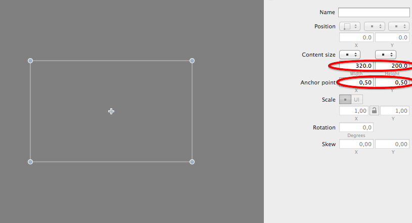
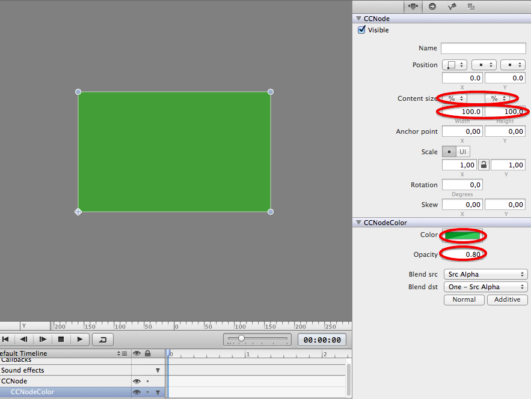
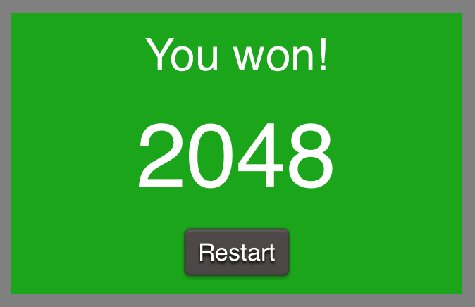
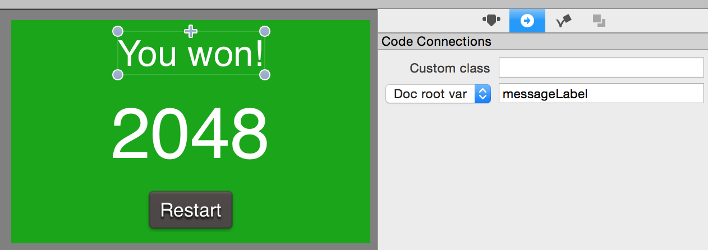
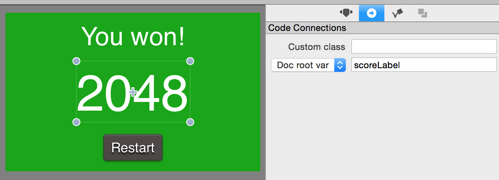
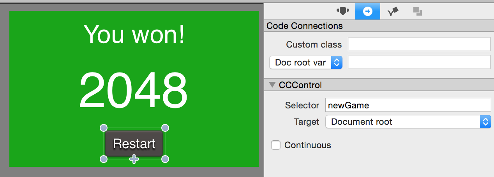
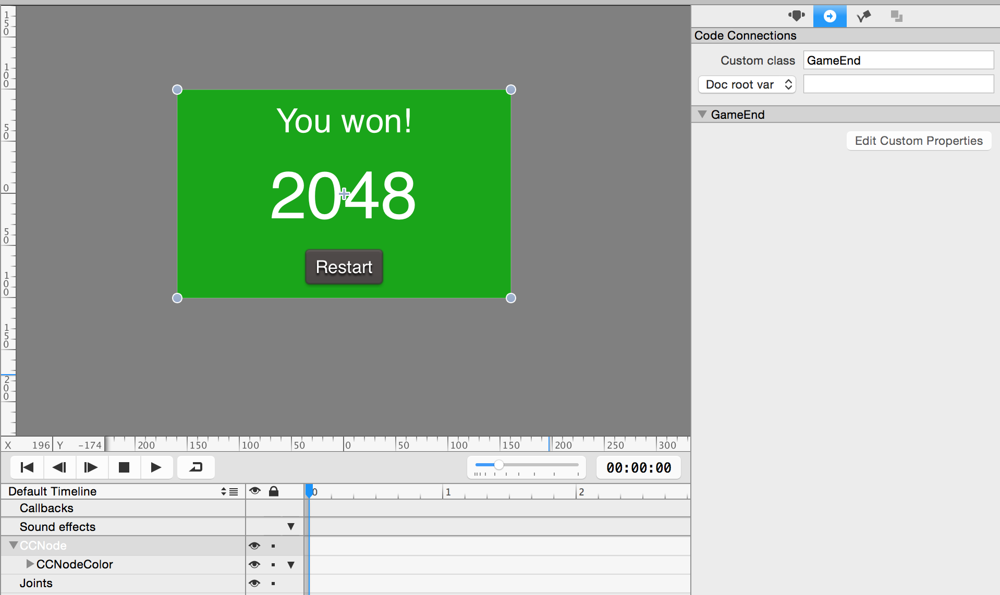
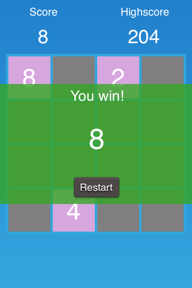
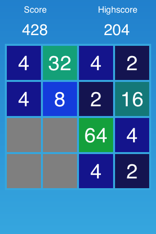

You now have a playable 2048 game! Let's add some final touches to give this game the polish it deserves.

#Create a Game Over screen

Our game can already detect when a player has won or lost. However, we are currently only logging a message to the console. In this step, we are going to add a game over screen with a restart button.

#In SpriteBuilder

> [action]
> Open the SpriteBuilder project and create a new CCB *Node* file:
>
> 
>
> Set the *root node size* to `(320, 200)` and the *anchor point* to `(0.5, 0.5)`:
>
> 
>
> Add a *CCNodeColor* to this node:
>
> 
>
> Set the *width* and the *height* to `100%` of the parent container. Set the *background color* to `green` and the *opacity* to `0.8`. Now we have a green slightly transparent background for our game over screen.
>
> Now we'll need to add two labels to display a game over message and the score that the player has achieved. Additionally we are going to add a button to restart the game.
>
> Add two labels and a button to the node so that your game end screen looks similar to this:
>
> 
>
> Now we need to set up some code connections. We need to change the text label that displays the win/lose text and we need to update the score that is displayed. Additionally we need to link a method to the `Restart` button. Link the top label to a *messageLabel* variable:
>
> 
>
> Link the displayed score to a variable called *scoreLabel*:
>
> 
>
> Set up a selector called `newGame` for the `Restart` button:
>
> 
>
> Finally, set up a custom class called *GameEnd* for the root node.
>
> 

Now we are done with the setup in SpriteBuilder. **Be sure to publish the project and before switching to Xcode.**

#In Xcode

We need to create the *GameEnd* class that is linked to the CCB file we just created in SpriteBuilder. Create a new Swift file by going to File -> New -> File and selecting Swift File. Call it `GameEnd`.

Next, we need to set up the variables and methods that we have linked in our SpriteBuilder project.

> [action]
> Set up the `GameEnd` class with our code connections:
>
>       class GameEnd: CCNode {
>           weak var messageLabel: CCLabelTTF!
>           weak var scoreLabel: CCLabelTTF!
>
>       }
>
> Next, add the *newGame* method that will be called when a user hits the restart button on the *endGame* screen:
>
>       func newGame() {
>           let mainScene= CCBReader.loadAsScene("MainScene")
>           CCDirector.sharedDirector().presentScene(mainScene)
>       }

This method simply reloads the *MainScene* which restarts the entire game.

The game over screen we are implementing right now will be presented by the *Grid* once a game ends. As you may remember the *Grid* provides two different messages, depending on the outcome of the game. We need to provide a way for the *Grid* to inform the game over screen which text should be displayed. Additionally it would be great if the final score of the game could be handed to the game over screen in the same method.

> [action]
> Add the implementation of this method to *GameEnd*:
>
>       func setMessage(message: String, score: Int) {
>           messageLabel.string = message
>           scoreLabel.string = "\(score)"
>       }

All we are doing is updating the content of both labels.

Now we can move on to the final step of implementing the game end screen - presenting it!

Now we need to add some code to display the *GameEnd* as a popup once a game ends. The place to do that is the *endGameWithMessage* method.

> [action]
> Add the following lines to the beginning of the *endGameWithMessage* method in *Grid*:
>
>       let gameEndPopover = CCBReader.load("GameEnd") as! GameEnd
>       gameEndPopover.positionType = CCPositionType(xUnit: .Normalized, yUnit: .Normalized, corner: .BottomLeft)
>       gameEndPopover.position = ccp(0.5, 0.5)
>       gameEndPopover.zOrder = Int.max
>       gameEndPopover.setMessage(message, score: score)
>       addChild(gameEndPopover)

 **Now everything is in place!** We are setting the game end screen up and presenting it when a game terminates. You should now test this feature (hint: changing the *winTile* value makes testing a lot easier). When you win or lose a game you should see a result similar to this:

Basically the game is complete now! There's one minor detail missing: changing the color of tiles depending on their value. That's the last polishing step in this tutorial.

#Polishing: colorful tiles

This is the last step and it isn't going to be very complicated. You only need to add a large switch-statement to the *Tile* class.

> [action]
> Add the following method to `Tile`:
>
>       func updateColor() {
>           var backgroundColor: CCColor
>
>           switch value {
>           case 2:
>               backgroundColor = CCColor(red: 20.0/255, green: 20.0/255, blue: 80.0/255)
>               break
>           case 4:
>               backgroundColor = CCColor(red: 20.0/255, green: 20.0/255, blue: 140.0/255)
>               break
>           case 8:
>               backgroundColor = CCColor(red:20.0/255, green:60.0/255, blue:220.0/255)
>               break
>           case 16:
>               backgroundColor = CCColor(red:20.0/255, green:120.0/255, blue:120.0/255)
>               break
>           case 32:
>               backgroundColor = CCColor(red:20.0/255, green:160.0/255, blue:120.0/255)
>               break
>           case 64:
>               backgroundColor = CCColor(red:20.0/255, green:160.0/255, blue:60.0/255)
>               break
>           case 128:
>               backgroundColor = CCColor(red:50.0/255, green:160.0/255, blue:60.0/255)
>               break
>           case 256:
>               backgroundColor = CCColor(red:80.0/255, green:120.0/255, blue:60.0/255)
>               break
>           case 512:
>               backgroundColor = CCColor(red:140.0/255, green:70.0/255, blue:60.0/255)
>               break
>           case 1024:
>               backgroundColor = CCColor(red:170.0/255, green:30.0/255, blue:60.0/255)
>               break
>           case 2048:
>               backgroundColor = CCColor(red:220.0/255, green:30.0/255, blue:30.0/255)
>               break
>           default:
>               backgroundColor = CCColor.greenColor()
>               break
>           }
>
>           backgroundNode.color = backgroundColor
>       }
>
> Now call this method from your `didSet` property observer on `value`:
>
>       var value: Int = 0 {
>           didSet {
>               valueLabel.string = "\(value)"
>               updateColor()
>           }
>       }

All this switch-case does is mapping a tile number to a color. Now your game should look a little more colorful:

**You're done!** Congratulations, you have come a really long way. I hope you enjoyed and once again learned a lot more about iOS and game development!

#Solution

The solution to this [tutorial is available on GitHub](https://github.com/MakeSchool/2048-SpriteBuilder-Swift).

